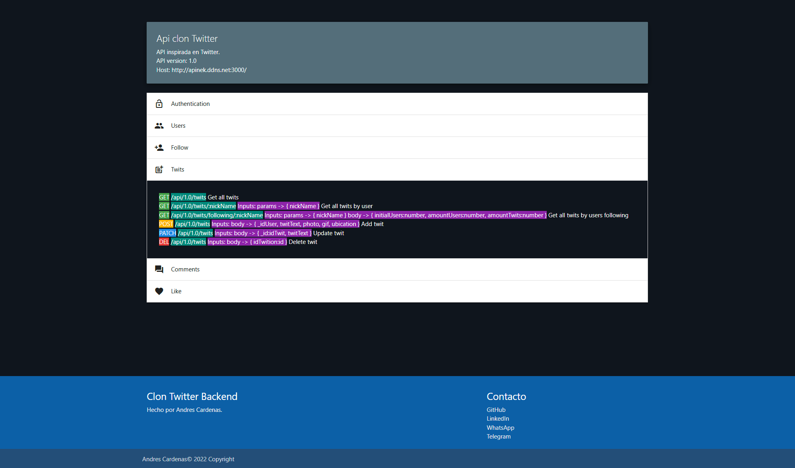

# Clon de Twitter - Backend

**Usando NodeJS y MongoDB se desarrolla un clon de Twitter por parte del Backend**

### Servicios
    1. Registro de usuarios
    2. Sistema de seguidores
    3. Sistema de twits
    4. Sistema de likes
    5. Sistema de comentarios
    
    Cada uno tiene sus endpoints para crear, leer, actualizar y eliminar datos.
    Los Twits se van a ver si el usuario sigue a alguien, si el usuario ha comentado a alguien, si el usuario ha likeado a alguien.

Imagen de la docuemtación web
